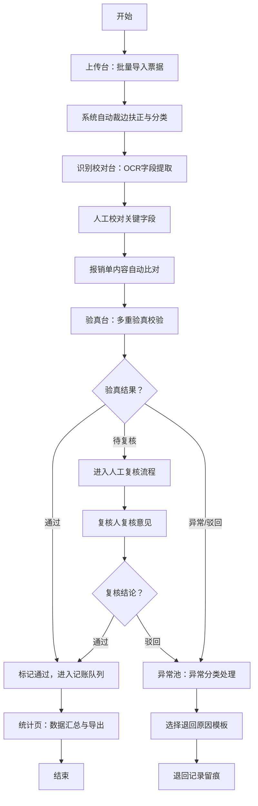

## 1. 产品概述

票据影像识别验真工作台是面向企业财务共享中心录单员的专业作业平台，聚焦于报销单、增值税发票、收据和行程票混合入池后的快速初审工作。通过"先识别、再验真、后分流"的作业流程，录单员可在一个界面内完成批量导入、自动识别、人工校对、验真比对、异常分流等大部分初审动作，大幅提升财务共享中心的票据处理效率和准确性。

- 目标用户：企业财务共享中心录单员、审核岗
- 核心价值：提升票据初审效率、降低人工识别误差、强化合规风控、实现流程可追溯

## 2. 核心功能

### 2.1 用户角色

| 角色 | 登录方式 | 核心权限 |
|------|----------|----------|
| 录单员 | 企业SSO/账号密码 | 上传票据、识别校对、验真操作、退回单据、查看统计 |
| 审核主管 | 企业SSO/账号密码 | 规则配置、数据统计导出、异常复核、全流程查看 |

### 2.2 功能模块

1. **上传台**：批量导入扫描件与拍照件、上传进度、文件列表管理
2. **识别校对台**：自动裁边扶正、票面分类、OCR字段提取、人工校对修正
3. **验真台**：自动比对报销单、查重拦截、验真状态分级、版式异常提示
4. **异常池**：异常单据管理、涂改痕迹提示、连号票预警、退回原因模板
5. **规则配置**：校验规则设置、退回原因模板管理、预警阈值配置
6. **统计页**：部门/批次通过率汇总、处理效率统计、复核结果导出

### 2.3 页面详情

| 页面名称 | 模块名称 | 功能描述 |
|----------|----------|----------|
| 上传台 | 批量上传区 | 支持拖拽上传、文件选择、多格式支持（PDF/JPG/PNG/TIFF） |
| 上传台 | 上传进度 | 显示文件上传进度、识别进度、成功/失败状态 |
| 上传台 | 文件列表 | 批次管理、文件预览、删除重传、批次标签 |
| 识别校对台 | 票据影像区 | 票据图片展示、放大缩小、裁边扶正效果预览、多页切换 |
| 识别校对台 | 票面分类 | 自动识别票据类型（增值税专票/普票、收据、行程单、报销单）、支持人工修改 |
| 识别校对台 | 字段提取区 | 票号、金额、日期、税额、购买方、销售方等字段自动填充与可编辑 |
| 识别校对台 | 报销单比对 | 报销单填报内容与票据识别结果自动比对，差异高亮显示 |
| 验真台 | 验真状态面板 | 分级状态显示（通过/待复核/异常/驳回），颜色编码区分 |
| 验真台 | 查重拦截 | 同票号重复报销检测，显示历史报销记录 |
| 验真台 | 版式异常检测 | 票面缺损、模糊、非标准版式提示 |
| 验真台 | 风险预警 | 连号票检测、同商户集中报销预警、金额异常波动提示 |
| 异常池 | 异常单据列表 | 分类展示各类异常票据，支持筛选与批量操作 |
| 异常池 | 涂改痕迹识别 | 涂改区域高亮标注、修改前后对比提示 |
| 异常池 | 退回操作 | 退回原因模板选择、自定义备注、退回记录留痕 |
| 异常池 | 人工复核 | 复核意见录入、复核人签名、复核时间戳 |
| 规则配置 | 校验规则 | 查重规则、连号阈值、金额异常阈值、商户集中度配置 |
| 规则配置 | 退回模板 | 预设退回原因增删改、模板分类管理 |
| 规则配置 | 识别参数 | OCR识别置信度阈值、自动裁边灵敏度设置 |
| 统计页 | 通过率看板 | 按部门、批次、票据类型统计通过率与驳回率 |
| 统计页 | 处理效率 | 人均处理量、平均处理时长、时段工作量分布 |
| 统计页 | 导出功能 | 复核结果导出Excel/PDF、支持自定义导出字段 |

## 3. 核心流程

录单员登录工作台后，首先在上传台批量导入待处理的票据扫描件或拍照件，系统自动进行裁边扶正和票面分类识别。识别完成后进入识别校对台，录单员对OCR提取的关键字段进行人工校对，同时系统自动比对报销单填报内容并高亮差异。校对完成后进入验真台，系统执行查重检测、版式校验、连号票和同商户预警等多重验真，录单员根据验真状态分级结果进行处理。存在异常或涂改痕迹的票据自动进入异常池，录单员可选择预设退回原因模板或自定义备注后退回。审核主管可在规则配置页面调整各项校验参数，并通过统计页查看各部门通过率和处理效率，导出复核结果给后续记账岗位。

## 4. 用户界面设计

### 4.1 设计风格

- 主色调：深蓝灰色系（#1E3A5F 主色、#2E5A8F 辅助色），体现财务专业稳重感
- 强调色：翠绿色（#10B981 表示通过）、琥珀色（#F59E0B 表示待复核）、红色（#EF4444 表示异常驳回）
- 中性色：石灰色系（#F8FAFC #F1F5F9 #E2E8F0 #94A3B8 #475569 #1E293B）
- 按钮风格：直角微圆角（radius 2px）、扁平设计、明确的状态色区分
- 字体：系统字体栈优先，中文使用"PingFang SC"、"Microsoft YaHei"，数字使用等宽字体增强可读性
- 布局风格：左右分栏主工作台布局 + 顶部导航，高密度信息展示，强调操作效率
- 图标风格：Lucide线性图标，统一16px/20px尺寸，保持简洁专业

### 4.2 页面设计概述

| 页面名称 | 模块名称 | UI元素 |
|----------|----------|----------|
| 上传台 | 批量上传区 | 大尺寸拖拽区域、虚线边框、hover高亮、上传图标动画、文件格式提示 |
| 上传台 | 上传进度 | 进度条组件、状态徽章、批量操作工具栏、批次筛选器 |
| 识别校对台 | 三栏布局 | 左侧票据列表（缩略图+状态）、中间大图预览、右侧字段编辑面板 |
| 识别校对台 | 影像预览区 | 图片缩放控制、旋转按钮、裁边标记框、差异高亮遮罩层 |
| 识别校对台 | 字段面板 | 标签+输入框表格布局、置信度色条、差异红色高亮、批量确认按钮 |
| 验真台 | 状态面板 | 顶部状态汇总卡片、四色状态徽章、风险预警列表带图标 |
| 验真台 | 验真详情 | 折叠面板分组展示（查重/版式/风险/比对）、每项有通过/警告/错误图标 |
| 异常池 | 异常列表 | 表格高密度布局、异常类型标签列、批量勾选、快捷操作按钮 |
| 异常池 | 退回弹窗 | 模板下拉选择、多行文本备注、操作人信息、确认/取消按钮 |
| 规则配置 | 配置表单 | 分组卡片、滑块控件、开关组件、保存/重置按钮 |
| 统计页 | 数据看板 | 卡片式KPI指标、趋势折线图、部门通过率柱状图、导出工具栏 |

### 4.3 响应式

桌面优先设计（最小支持1366×768），信息密度高，适合录单员长时间作业。不做移动端适配，聚焦桌面端操作效率。

### 4.4 交互细节

- 图片上传时使用脉冲动画提示上传中状态
- 字段校对时，低置信度字段自动聚焦并黄色闪烁提示
- 异常预警出现时顶部toast通知 + 列表项红边强调
- 操作按钮hover有微位移+阴影变化，反馈点击感
- 表格行hover高亮，支持键盘快捷键切换单据
