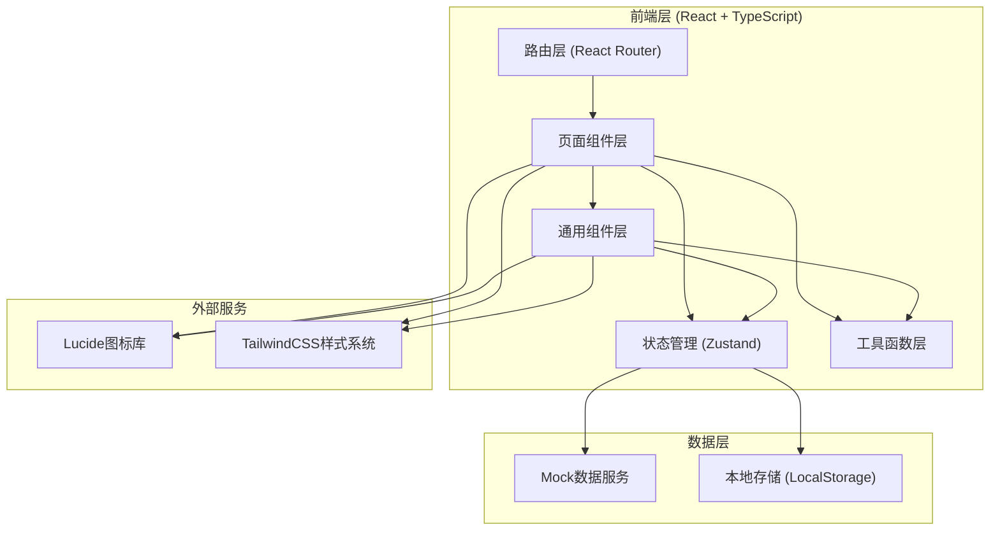
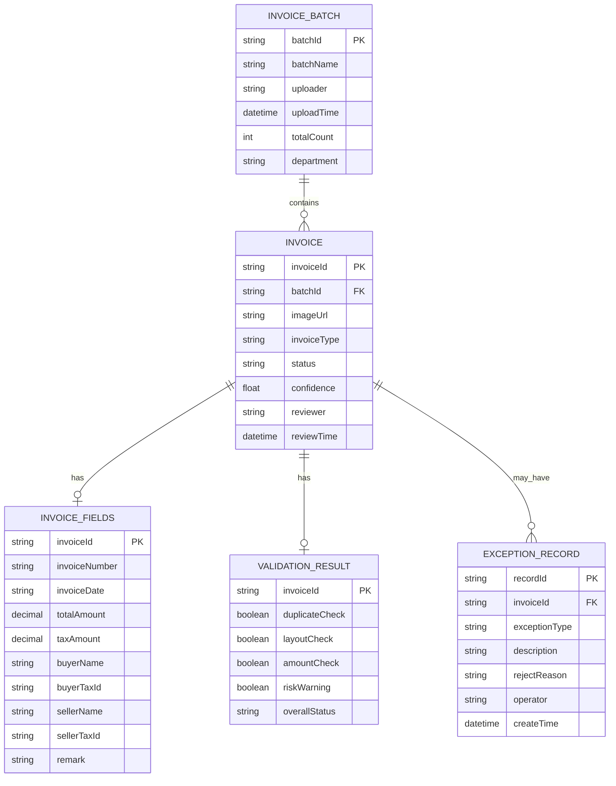

## 1. 架构设计



## 2. 技术描述

- 前端框架：React 18 + TypeScript
- 构建工具：Vite 5
- 样式方案：TailwindCSS 3（自定义主题配置）
- 路由管理：React Router DOM v6
- 状态管理：Zustand 4
- 图标库：Lucide React
- 后端服务：纯前端项目，使用Mock数据模拟后端API
- 数据持久化：LocalStorage存储用户操作记录与配置

## 3. 路由定义

| 路由路径 | 页面名称 | 说明 |
|----------|----------|------|
| /upload | 上传台 | 票据批量导入与上传进度管理 |
| /verify | 识别校对台 | OCR识别结果校对与字段编辑 |
| /validate | 验真台 | 多重验真校验与状态展示 |
| /exceptions | 异常池 | 异常单据处理与退回操作 |
| /settings | 规则配置 | 校验规则、退回模板、识别参数配置 |
| /statistics | 统计页 | 数据统计看板与结果导出 |
| / | 重定向到 /upload | 默认入口 |

## 4. 数据模型

### 4.1 核心数据结构



### 4.2 TypeScript类型定义

```typescript
// 票据类型
type InvoiceType = 'vat_special' | 'vat_normal' | 'receipt' | 'itinerary' | 'reimbursement';

// 票据状态
type InvoiceStatus = 'uploading' | 'recognizing' | 'pending_review' | 'reviewing' | 'validating' | 'passed' | 'pending_recheck' | 'exception' | 'rejected';

// 验真状态
type ValidationStatus = 'passed' | 'warning' | 'failed';

interface InvoiceBatch {
  batchId: string;
  batchName: string;
  uploader: string;
  uploadTime: string;
  totalCount: number;
  processedCount: number;
  department: string;
}

interface Invoice {
  invoiceId: string;
  batchId: string;
  imageUrl: string;
  invoiceType: InvoiceType;
  status: InvoiceStatus;
  confidence: number;
  reviewer?: string;
  reviewTime?: string;
  fields: InvoiceFields;
  validation: ValidationResult;
  exceptions?: ExceptionRecord[];
}

interface InvoiceFields {
  invoiceNumber: string;
  invoiceDate: string;
  totalAmount: number;
  taxAmount: number;
  buyerName: string;
  buyerTaxId: string;
  sellerName: string;
  sellerTaxId: string;
  remark?: string;
  fieldConfidence: Record<string, number>;
}

interface ValidationResult {
  duplicateCheck: ValidationStatus;
  layoutCheck: ValidationStatus;
  amountCheck: ValidationStatus;
  riskWarning: ValidationStatus;
  reimbursementMatch: ValidationStatus;
  overallStatus: InvoiceStatus;
  warnings: WarningItem[];
}

interface WarningItem {
  type: 'duplicate' | 'layout' | 'amount' | 'risk' | 'mismatch';
  level: 'info' | 'warning' | 'error';
  message: string;
  detail?: string;
}

interface ExceptionRecord {
  recordId: string;
  invoiceId: string;
  exceptionType: string;
  description: string;
  rejectReason?: string;
  rejectTemplateId?: string;
  operator: string;
  createTime: string;
}

interface RejectTemplate {
  templateId: string;
  category: string;
  content: string;
  enabled: boolean;
}

interface ValidationRules {
  duplicateCheckEnabled: boolean;
  consecutiveInvoiceThreshold: number;
  sameMerchantThreshold: number;
  amountDeviationThreshold: number;
  confidenceThreshold: number;
  autoCropSensitivity: 'low' | 'medium' | 'high';
}
```

## 5. 项目目录结构

```
src/
├── components/          # 通用组件
│   ├── Layout/          # 布局组件（侧边栏、顶部导航）
│   ├── common/          # 通用UI组件（按钮、输入框、表格等）
│   └── invoice/         # 票据相关组件
├── pages/               # 页面组件
│   ├── UploadPage.tsx
│   ├── VerifyPage.tsx
│   ├── ValidatePage.tsx
│   ├── ExceptionsPage.tsx
│   ├── SettingsPage.tsx
│   └── StatisticsPage.tsx
├── store/               # Zustand状态管理
│   ├── useInvoiceStore.ts
│   └── useSettingsStore.ts
├── types/               # TypeScript类型定义
│   └── index.ts
├── data/                # Mock数据
│   └── mockData.ts
├── utils/               # 工具函数
│   └── helpers.ts
├── App.tsx
├── main.tsx
└── index.css
```
